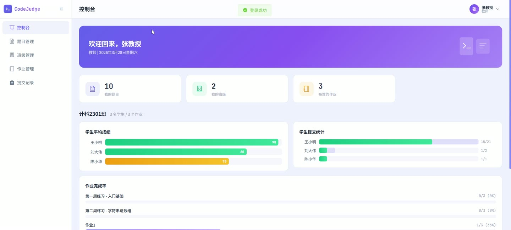
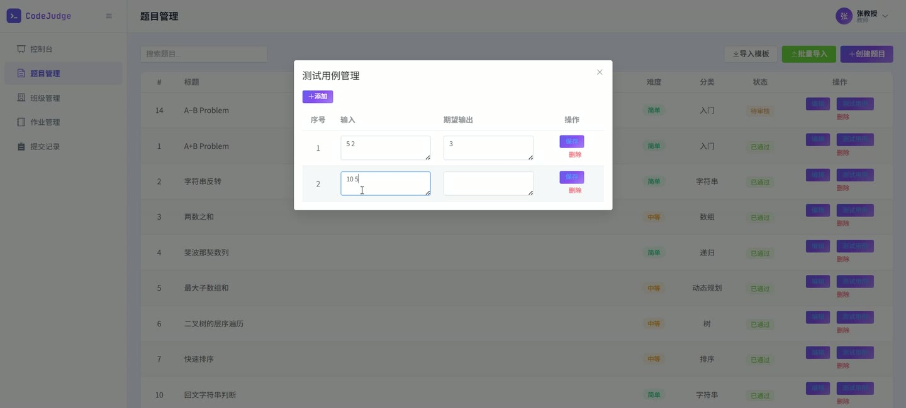
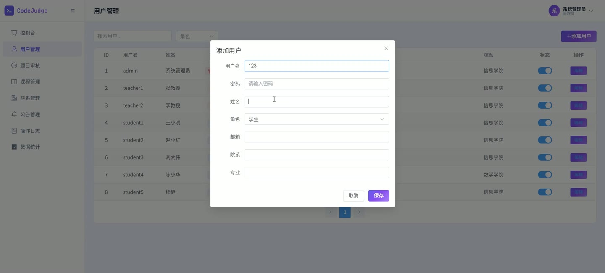

# (附文档)Springboot3+Vue3+MySQL 在线编程评测网站系统

**技术栈**：Springboot3、Vue3、MySQL

### 系统简介

本系统是一套基于 Spring Boot 3 + Vue 3 + MySQL 构建的在线编程评测网站，采用前后端分离架构。系统支持管理员、教师、学生三种角色，提供题目管理、代码提交与评测、班级管理、作业布置与评分、用户管理、系统公告、操作日志审计等核心功能，适用于高校编程教学、在线竞赛训练等场景。
 
### 核心功能
 
### 普通用户端

 
- 用户注册：填写用户名、密码、真实姓名、邮箱等信息完成注册，注册后默认角色为学生 
- 用户登录：输入用户名和密码进行登录，系统校验密码并生成 JWT Token 返回 
- 浏览题目列表：查看所有已审核通过的题目，支持按关键字、难度、分类筛选，分页展示 
- 查看题目详情：查看题目标题、描述、输入输出说明、样例输入输出、提示信息、时间/内存限制 
- 提交代码：在题目详情页编写代码并选择语言，提交后系统自动评测并返回结果（ACCEPTED/COMPILE_ERROR） 
- 查看个人提交记录：查看自己所有的提交列表，支持按题目 ID 筛选，显示提交结果、用时、内存、得分 
- 查看提交详情：查看单次提交的代码内容、评测结果、时间消耗、内存消耗 
- 查看公告列表：浏览系统发布的公告，按时间倒序排列 
- 查看系统统计：查看题目总数、用户总数、提交总数等全局统计数据 
- 查看题目分类列表：获取所有已审核通过的题目分类标签
 
### 学生端

 
- 查看我的班级：显示当前学生加入的所有班级列表，包含班级名称、专业、年级、授课教师 
- 查看作业列表：查看所有班级的作业列表，显示作业标题、所属班级、截止时间、题目数量、已完成题目数、是否全部完成、教师评分与评语 
- 查看作业详情：查看单个作业包含的题目列表，显示每道题目的标题、难度、是否已通过（ACCEPTED） 
- 查看作业得分：在作业详情中查看教师给出的评分和评语
 
### 教师端

 
- 班级管理：创建、编辑、删除自己负责的班级，填写班级名称、专业、年级 
- 班级学生管理：查看班级内的学生列表，支持按用户名添加学生，移除班级中的学生 
- 作业管理：创建、编辑、删除作业，填写作业标题、选择所属班级、设置截止时间，选择作业包含的题目（支持多选） 
- 查看作业题目列表：查看指定作业中包含的所有题目，按排序顺序展示 
- 评分管理：查看指定作业下所有学生的提交次数、评分与评语，支持录入或修改评分和评语 
- 查看学生作业提交详情：查看指定学生在指定作业中每道题目的所有提交记录，包含代码、结果、用时、内存 
- 班级统计：查看每个班级的学生数量、作业数量，以及每位学生的总提交数、AC 提交数、平均分 
- 作业完成率统计：查看每个作业的完成人数、完成率 
- 题目管理：创建、编辑、删除自己创建的题目，填写题目标题、描述、输入/输出说明、样例、难度、分类、时间/内存限制 
- 测试用例管理：为题目添加、编辑、删除测试用例，填写输入和期望输出，支持排序 
- 批量导入题目：通过上传 CSV 或 Excel 文件批量创建题目，支持下载导入模板 
- 查看自己创建的题目列表：分页查看，支持按关键字搜索
 
### 管理员端

 
- 用户管理：查看所有用户列表，支持按用户名/真实姓名搜索，按角色筛选，分页展示 
- 创建用户：添加新用户，填写用户名、密码、真实姓名、角色、邮箱、院系、专业 
- 编辑用户：修改用户信息，包括密码、真实姓名、角色、邮箱、院系、专业 
- 启用/停用用户：一键切换用户状态（启用/停用），停用后用户无法登录 
- 题目审核：查看所有待审核/已审核的题目列表，支持按审核状态筛选 
- 审核题目：通过或驳回题目，审核通过后题目将在前台可见 
- 课程管理：创建、编辑、删除课程，填写课程名称、学期、描述 
- 院系管理：创建、编辑、删除院系 
- 专业管理：创建、编辑、删除专业，关联所属院系 
- 公告管理：发布、编辑、删除系统公告，公告支持启用/停用状态 
- 操作日志查看：查看所有用户的操作日志，支持按日期范围筛选，包含操作内容、方法、IP 地址 
- 系统统计：查看总用户数、学生数、教师数、总题目数、待审核题目数、总提交数，以及近 7 天每日提交趋势和每日新增用户趋势
 
### 技术栈

 后端框架Spring Boot 3.x ORMMyBatis-Plus 3.x（自动填充、分页插件） 权限认证JWT（jjwt） 密码加密Spring Security Crypto（BCryptPasswordEncoder） 前端框架Vue 3 构建工具Vite 数据库MySQL 8.x 文件上传Spring MultipartFile Excel/CSV 处理Apache POI 操作日志AOP 切面（OperationLogAspect）
 
### 交付内容

 
- 后端完整源码 
- 前端完整源码 
- 数据库初始化脚本 
- 万字文档

## 界面展示

---

## 获取完整源码 + 万字文档

本仓库为项目介绍页。**完整前后端源码、数据库初始化脚本、万字项目文档**，请加微信 `kangkangcode`，或访问 [codekk.top](http://codekk.top) 获取。

可作课程设计 / 毕业设计参考，支持远程部署调试。